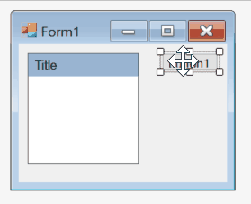
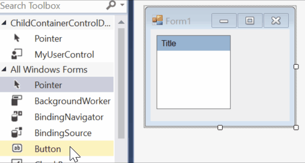

# Enable Child Control Designer

This example shows how you can create a composite control (UserControl) and let the user to interact with a child control of your user control.

> Read the full article [here](http://www.reza-aghaei.com/enable-designer-of-child-panel-in-a-usercontrol/).

For example, I created a `UserControl` containing a title panel and a contents panel. Here are the requirement that I want to be able to satisfy with this control:

- Users should be able to drop controls on the contents panel at design time.
- Users should not be able to drop controls on title panel.
- Users should not be able to select title panel or change its properties.
- Users should be able to select contents panel. 
- Users should be able to change properties of contents panel.
- Users should not be able to move or delete contents panel.

